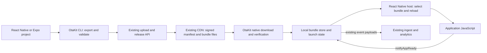
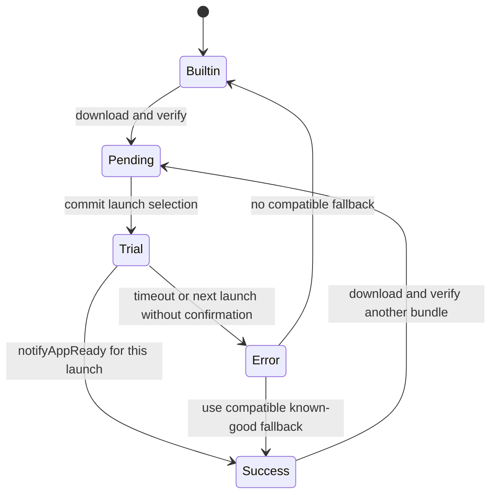

# OtaKit React Native updater: production architecture

Date: 2026-09-11. Status: implementation plan, revised against published RN/Expo sources, executable JavaScript integration probes, and the delivery review. No plugin implementation or native-device validation has been completed. The [integration verification record](integration-verification.md) distinguishes upstream facts from implementation acceptance; [review resolution](review-resolution.md) records the delivery decisions and their checks.

**Build `@otakit/react-native-updater` with one OtaKit app per mobile product. Give the app an explicit framework (`capacitor` or `react-native`), each bundle a target platform (`ios`, `android`, or `cross`), and each release a reference to exactly one bundle.** Extend the existing upload, release, CDN manifest, and signing code to carry these fields. Reuse storage, billing, event ingestion, and native updater helpers.

The customer publishes **one version**, such as `1.4.2`. OtaKit groups the necessary iOS/Android and native-runtime bundles under that version and serves each device its exact match. The CLI generates these labels from validated build records; customers do not invent version suffixes or edit runtime hashes. A runtime identifies compatible native inputs, so repeating a build with unchanged inputs does not itself create another runtime.

For Capacitor, keep the existing shared web bundle, manifest URL, v2 signatures, and one request per check. RN support does not require a Capacitor client upgrade or per-OS Capacitor releases. For RN, retain separate platform/runtime bundles and exact compatibility checks. [Capacitor's shared web build](https://capacitorjs.com/docs/basics/workflow), [RN platform-specific bundling](https://metrobundler.dev/docs/resolution/)

This is the production design requested after the [market and implementation research](README.md). It supersedes that report's preference for an Expo update-server adapter and the earlier plan's encoding of platform in runtime/version strings. Production acceptance is part of implementation; there is no separate experimental product or temporary backend.

**Expo's role is to supply verified integration references and selected tooling.** Borrow the relevant native launch/reload patterns from its published implementation and adapt them to OtaKit's architecture. Select each pattern for correctness, compatibility with RN, and maintenance cost; its use by Expo alone is not a reason to adopt it. OtaKit owns the update engine, manifest protocol, delivery, runtime compatibility decisions, staging, explicit `notifyAppReady()` contract, rollback policy, and analytics.

| Relationship to Expo       | What this plan means                                                                                                                                                      |
| -------------------------- | ------------------------------------------------------------------------------------------------------------------------------------------------------------------------- |
| Integration patterns       | Implement the relevant RN lifecycle mechanisms in OtaKit, informed by verified Expo source. Preserve license notices when copying source.                                 |
| Standalone dependency      | Reuse `@expo/fingerprint` as build tooling for native input collection; OtaKit validates the build record and decides compatibility.                                      |
| Expo project compatibility | Use the project's installed Expo tooling and preserve its host, Router, splash, DOM, and config behavior through small adapters. Bare RN needs no native Expo dependency. |
| Update engine              | Build `@otakit/react-native-updater`; do not wrap or fork `expo-updates` as the engine or adopt its updater state machine and readiness policy.                           |

The borrowed patterns have been checked against published upstream source. Their adaptation to OtaKit still requires the native release/device acceptance tests below; source verification does not establish that our implementation works. Expo-specific adapters are OtaKit integration proposals with their own validation and SDK maintenance requirements.

## 1. Overall architecture



The installed binary contains the plugin, trusted signing keys, its runtime ID, and a working embedded application. The native updater downloads and verifies updates into private storage. React Native receives a local bundle path before it initializes JavaScript. The app confirms readiness through the same explicit API as the Capacitor plugin.

An application install never needs console credentials or a live control-plane request to launch. Manifest and payload requests go to the CDN; events go to the existing ingest endpoint.

| Area              | Decision                                                                                             |
| ----------------- | ---------------------------------------------------------------------------------------------------- |
| Native client     | Our Swift and Java/Kotlin updater, exposed through a React Native TurboModule                        |
| Protocol          | RN manifest v3 with target/content identity; existing ES256 algorithm; Capacitor stays on v2         |
| Platforms         | iOS and Android, Hermes, New Architecture                                                            |
| Release selection | App + target platform + channel + runtime; framework belongs to the app                              |
| Delivery          | ZIP by default; existing file deltas also supported                                                  |
| Recovery          | Native persisted trial state, explicit readiness, known-good/embedded fallback                       |
| Analytics         | Existing four event actions and ingest API                                                           |
| Server work       | Explicit framework/target fields, indexed release lanes, runtime-aware bundle uniqueness and signing |
| Build integration | Bare RN integration plus an Expo config plugin; neither requires EAS Update                          |

Start acceptance with bare RN **0.86.3 and 0.87.0**, and **`expo@57.0.17` with RN 0.86.3**. The published Expo package names that RN version in `bundledNativeModules.json`; its released host integration was inspected directly. Pin `@expo/cli@57.0.19`, `expo-constants@57.0.15`, `expo-asset@57.0.15`, and `@expo/dom-webview@57.0.1` in the Expo fixture. `expo-updates@57.0.18` is a behavioral reference and migration fixture, not the installed OtaKit update engine. Package integrity values and selected source hashes are in [integration-sources.json](integration-sources.json). Expand the supported patch matrix only after acceptance passes. These are **targets to validate**, not current support claims. [RN versions](https://reactnative.dev/versions), [Expo SDK 57](https://expo.dev/changelog/sdk-57)

One main RN host per application is the supported topology, including Android Headless JS using that same host and iOS background process launches. Expo DOM components are included through the adapter below; their WebView does not become another RN host. Desktop, TV, old architecture, alternative RN JS engines, RAM bundles, multiple RN hosts, and experimental worklet bundle modes need separate compatibility work. Standard Reanimated/worklets used through the normal Metro bundle belong in the release fixtures. A background framework that creates a separate RN host must be identified by `doctor` and given its own integration before being added to the supported matrix.

## 2. One app, explicit framework and platform

### Data model

Use these public values consistently in the API, CLI, and dashboard:

```ts
type Framework = 'capacitor' | 'react-native';
type BundleTarget = 'ios' | 'android' | 'cross';
```

`App.framework` selects the updater/build family. `Bundle.platform` describes where that specific executable artifact can run. The app has no platform column; its bundles can target either OS as needed. Each release points to exactly one bundle through `bundleId`. Its immutable `platform` and `runtimeVersion` are copied from that bundle at creation and must continue to agree with it. A bundle may have multiple releases, for example to beta and production channels; it is never reassigned to a different native runtime.

```text
App (framework)
  └─ Bundle (platform, version, runtime)
       └─ Release (bundleId, copied platform/runtime, channel, publication settings)
```

Persist the two release targeting fields so lane lookup has a direct database index. They are snapshots of the chosen bundle, not independent overrides. The existing `Release.appId` must also agree with `Bundle.appId`. Validate this invariant in the shared release service for every entry point; backfill historical releases from their bundles. Bundles remain immutable after finalization. A release row cannot combine multiple bundles; the customer-facing version groups those rows without adding a release-group table.

| Record               | Field/change                                                        | Meaning                                                                  |
| -------------------- | ------------------------------------------------------------------- | ------------------------------------------------------------------------ |
| App                  | `framework`, default `capacitor` for existing/legacy creation       | One framework for the mobile product                                     |
| Bundle               | `platform`                                                          | `cross` means one artifact can run on either OS                          |
| UploadSession        | `platform`                                                          | Persist the validated target through finalization                        |
| Release              | Immutable copied `platform` and `runtimeVersion`                    | Direct indexed lookup; must equal the selected bundle                    |
| ReleaseMutation      | `platform`                                                          | Async publication/retries must retain the exact lane                     |
| RN bundle uniqueness | `(appId, platform, runtimeVersion, version)`                        | Both OS targets and multiple native runtimes can share a display version |
| Capacitor uniqueness | Keep `(appId, version)` for `platform=cross`                        | Preserve current version conflict behavior, including nullable runtimes  |
| RN payload identity  | `contentHash` on bundle/upload session; validated `files` inventory | Recognize exact embedded content independently of ZIP/encryption bytes   |

Add database enums for framework and `BundleTarget`. Keep device platform as `ios | android`; the unused database `Platform` enum need not become the artifact enum. If Prisma uses an identifier such as `react_native`, map it explicitly to public `react-native`. Enforce nonempty RN runtime values in API and database constraints. Use a partial unique index for RN's complete key and a separate cross-only `(appId, version)` unique index for Capacitor; ordinary nullable-column uniqueness must not weaken Capacitor's existing rule. ORM lookups use these complete predicates or bundle IDs rather than retaining the old global `appId_version` lookup.

Index releases by `(appId, platform, channel, runtimeVersion, revertedAt, promotedAt DESC, id DESC)`, matching current-release filtering and tie-breaking. Update the mutation lane index to include platform. No fingerprint inspection or join to Bundle is needed to discover a release's lane, although Bundle is still read for its payload.

Example of **one** RN product:

```text
App:     id=my-app, framework=react-native
Bundle:  appId=my-app, version=1.4.2, platform=ios,     runtimeVersion=<older iOS runtime>
Bundle:  appId=my-app, version=1.4.2, platform=ios,     runtimeVersion=<newer iOS runtime>
Bundle:  appId=my-app, version=1.4.2, platform=android, runtimeVersion=<Android runtime>
```

A Capacitor product can have one `platform=cross` web bundle. A React Native product uses separate `ios` and `android` bundles under the same app; the server rejects a React Native `cross` bundle. A product shipping on only one OS simply uploads bundles for that OS.

| App framework | Allowed bundle platforms |
| ------------- | ------------------------ |
| capacitor     | cross                    |
| react-native  | ios, android             |

Framework becomes immutable once an app has uploads/bundles, so stored artifacts cannot be reinterpreted by changing the app. Validate each bundle's target against its app's framework at initiate/finalize/publish. There is no separate app-platform setting to synchronize or change before adding the other OS.

### Runtime and release identity

Runtime remains a native compatibility value. Generate the RN runtime as an unpadded base64url SHA-256 digest of the build record in section 4: 43 characters, within the existing 64-character limit. Platform remains an input to that record, but its digest is opaque. No runtime prefix is parsed to identify the framework or route the OS. Identical runtime strings on different platforms remain isolated by the explicit platform column.

Use the same human release version for all platform/runtime bundles in a publication. It retains the existing 1–64 character limit without platform or runtime suffixes. Different native runtimes may require different exports of the same JS fix. An artifact's database ID and transport hash identify its uploaded bytes; different bytes for the same `(appId, platform, runtimeVersion, version)` are a conflict. Runtime is a compatibility value, not a nonce for bypassing immutability. Common asset bytes may use the existing content-addressed delta storage; uploading a variant does not itself emit a device delivery event.

The complete release lane is:

```text
appId + platform + channel + runtimeVersion
```

Carry the complete lane through current-release lookup, prepare/publish/revert, prior-bundle selection, lane locks, stored mutations, retry workers, manifest restoration/deletion, and auto-revert candidates. Keep one helper for constructing its identity. Publication copies platform/runtime from the chosen bundle; any supplied targeting must agree. A release ID identifies a revert target. Require previous-bundle and revert targets to have the same app/platform/runtime; no runtime overrides or fingerprint-diff exceptions are accepted.

RN bundle lookup by version must include both platform and runtime, or return an explicit collection of variants. IDs remain unambiguous. RN upload requests supply both values; publication by bundle ID derives them. Omitted platform on a legacy Capacitor request means `cross`, never "the latest bundle of any platform." Framework is immutable on the app and does not need duplication into every table or lane key.

Release-state and summary responses expose current releases per platform/runtime. Preserve any legacy scalar current-release response only for the legacy cross target. No existing `findFirst` or "latest bundle" convenience path may silently pick iOS when the caller intended the whole app. Native compatibility comparisons and previous-bundle pointers also stay within the complete lane.

One CLI action publishes the complete prepared collection under one display version, with independent optimistic concurrency and idempotency for every platform/runtime. Preflight every variant and upload/finalize all files before publishing any selected lane. Keep a durable receipt of the intended targets and individual results; a retry resumes unfinished work without replacing a lane someone else changed. Show partial success explicitly. Separate manifest writes cannot promise simultaneous publication, and devices check at different times regardless.

Keep existing publish/revert request-hash fields: `bundleId` already determines platform/runtime and `releaseId` identifies a revert. Verify supplied targeting before idempotency replay rather than adding redundant fields to stored legacy hashes. The CLI gives each variant a distinct operation key in its receipt. Only a genuinely new selectable operation parameter would require a versioned request-hash contract.

### CDN layout and platform selection

Keep static CDN manifests and the existing asset object storage. Add a v3 namespace so old clients and new signed fields cannot be confused:

```text
{cdnUrl}/manifests/{appId}/v3/{platform}/{channelKey}/{runtimeKey}/manifest.json
```

Each RN manifest includes `schemaVersion: 3`, `framework`, target `platform`, and `contentHash`, alongside the existing fields. Bind them into the signature as described in section 8. Sign against the platform selected in the URL, never a target inferred from runtime naming. Putting the namespace below app ID keeps all manifests under the existing `manifests/{appId}/` deletion prefix. Test billing block, restoration, and any app-deletion cleanup against both URL families.

For RN, the native client's actual OS selects exactly one platform path and its embedded runtime selects exactly one runtime. Never request `cross` or the other OS, and never fall back to a null/different runtime.

Capacitor keeps its single existing `manifests/{appId}/{channelKey}/{runtimeKey}/manifest.json` request and v2 response. Do not add an OS-then-cross lookup, dual publication, or an RN-driven Capacitor upgrade. Cross remains the ordinary ongoing Capacitor target, not just a migration value.

Keep one RN manifest per exact platform/runtime/channel. A combined iOS/Android target map adds no benefit here: platform-specific runtime digests normally address different objects. Group variants in the publishing UX, while each device receives one small manifest and the correct bundle. OS-specific Capacitor delivery is outside this release.

The current [manifest publisher](../../packages/console/lib/manifest-files.ts) and [release service](../../packages/console/lib/services/releases.ts) need targeted platform propagation. CDN infrastructure, object hashes, encryption envelopes, and download storage keys do not need replacement. The cache/purge mechanism stays the same; publish/delete/purge every applicable namespace and retain accurate pending-publication status.

### Upload and delta validation

Resolve framework from the app record; validate target platform from the request and persist it in the upload session. Do not trust an arbitrary uploaded `framework` to bypass the app's validator. Legacy missing-platform requests are accepted only for Capacitor cross uploads. RN requires an explicit OS, nonempty runtime, `contentHash`, and a bounded plaintext payload file inventory for both ZIP and deltas. Reuse `UploadSession.files` for that inventory, copy it to a nullable `Bundle.contentFiles` JSON field on finalization, and use the existing canonical file-list hash for `contentHash`. These fields are mandatory for RN and absent for legacy Capacitor; customer-supplied generic metadata cannot override them. Use the existing 5,000-file/512-character path limits for RN inventories under either strategy. Sections 3 and 9 define the hashes and the embedded copy.

ZIP finalization currently checks object size and records the supplied hash without inspecting a web entrypoint. Preserve the existing transfer service while validating RN's declared inventory and enforcing the new uniqueness key. The CLI validates the actual files before archiving/encryption; native code verifies downloaded/extracted bytes against both signed identities. The server cannot prove an encrypted ZIP's contents from a caller-supplied inventory, and must not describe this preflight as byte verification. Fix the existing finalize conflict path to return an existing bundle only when app, version, platform, runtime, transport hash, content hash, size, strategy, and encryption agree; otherwise return a conflict. [ZIP finalization](../../packages/console/app/api/v1/apps/[appId]/bundles/finalize/route.ts)

Change delta validation to take the app's framework, independently of runtime naming:

```text
parseDeltaFiles(files, app.framework)

capacitor:    require index.html
react-native: require nonempty otakit-bundle.json and index.bundle
```

Keep all existing path, reserved-name, size, hash, MD5, and file-count checks. Use the shared RN path/inventory rules below in CLI preflight, upload validation, and native installation. Require MD5 only where the existing delta PUT contract needs it. Framework/platform validation applies to initiate, finalize, and publish. Descriptor contents are validated by the CLI and native client. No dummy HTML file is added. [Delta validation](../../packages/console/lib/delta-files.ts), [delta initiation](../../packages/console/app/api/v1/apps/[appId]/bundles/initiate-delta/route.ts)

### Portable filenames

For new RN artifacts, reject duplicate paths, file-versus-directory conflicts, canonical Unicode aliases, case-folded aliases, and reserved metadata aliases before upload. Require valid Unicode scalar strings encodable as UTF-8, alongside existing traversal/control-character rules. Build a path tree and compare every prefix as well as the complete filename: `Icons/a.png` and `icons/b.png` must not introduce two spellings of one portable directory. Derive comparison keys using the same pinned Unicode normalization/full case-folding rules across implementations; preserve the original accepted UTF-8 spelling in the payload and signed file list. Reject ambiguous input rather than silently renaming files or changing their hash. Use shared vectors for accented names, non-ASCII case pairs, directory aliases, and `BUNDLE.JSON`/`OTAKIT_FILES.JSON`.

iOS storage is case-sensitive, but treats canonically equivalent Unicode names as equivalent. Case-alias rejection is an intentional portability rule covering common macOS build environments, not a claim that iOS ignores letter case. Server checks protect the declared ZIP/delta inventory; native checks remain necessary for actual payloads and callers that bypass the CLI. This RN validation contract does not retroactively reject stored Capacitor bundles. [Apple filename rules](https://developer.apple.com/library/archive/documentation/FileManagement/Conceptual/APFS_Guide/FAQ/FAQ.html)

RN clients and CLI require the server version supporting this model. Do not silently translate requests back into runtime prefixes for older self-hosted servers. Existing Capacitor clients retain their legacy path and defaults through the migration in section 14.

## 3. The artifact format

Both ZIP and deltas assemble the same directory:

```text
otakit-bundle.json
index.bundle
assets/...                 # Metro's iOS/generic relative asset layout
drawable-mdpi/...          # Metro's Android layout, as applicable
drawable-xhdpi/...
raw/...
expo-config.json          # Expo public config snapshot; absent for bare RN
www.bundle/...            # Expo export:embed DOM output, when present
```

The directory is platform-specific. Preserve the exporter-generated asset paths; these examples are not instructions to manufacture every directory. Keep source maps, build receipts, and secrets outside the public payload.

Give the payload a `contentHash`: SHA-256 of the existing canonical file list, with each plaintext file's path and SHA-256, sorted by UTF-8 path bytes. Include `otakit-bundle.json`, JS, assets, and any Expo config/DOM files. Exclude only non-payload native receipts and OtaKit-owned local state; reject those reserved files if they appear in the uploaded payload. `contentHash` is stored in the upload/bundle record, signed v3 manifest, and native embedded receipt, **not inside the hashed descriptor**, avoiding a self-reference.

Keep the existing `sha256` transport field unchanged: for ZIP it identifies the transferred archive (ciphertext when encrypted); for deltas it identifies the canonical file list. Thus RN deltas have `contentHash == sha256 == filesHash`, while ZIP content identity survives compression or encryption differences. Signed `contentHash` identifies which application files are selected; it does not replace archive/file verification. The native build records it from the exact final Hermes export used to construct the embedded application.

The new descriptor is part of the verified artifact, not a new server manifest:

```json
{
  "format": "otakit-rn",
  "formatVersion": 1,
  "framework": "react-native",
  "platform": "ios",
  "runtimeVersion": "<43-character native compatibility digest>",
  "version": "20260910.1",
  "entryPoint": "index.bundle",
  "engine": "hermes",
  "bundleFormat": "hermes-bytecode",
  "reactNativeVersion": "0.87.0"
}
```

The runtime example is abbreviated. The native client requires the real full-length value and exact agreement on app framework, platform, and runtime between its native configuration, signed manifest, and descriptor. It checks the Hermes bytecode header against the build's expected format. The runtime digest remains the compatibility authority within that platform: identical Hermes bytecode versions alone do not prove native-module compatibility.

`entryPoint` is fixed to `index.bundle` for format 1. Reject unknown format versions and conflicting platform/runtime values. Never execute another file supplied by an arbitrary path in metadata. `bundle.json` and `otakit_files.json` remain reserved for OtaKit's local metadata where existing code uses them.

Expo exports add `expo: { "configFile": "expo-config.json", "domRoot": "www.bundle" }` to the descriptor; omit `domRoot` when no DOM output exists. These are fixed format-1 locations, not arbitrary paths or remote URLs. Both ZIP and deltas authenticate these files through their existing artifact hashes. Validate the public config as a JSON object, with a 256 KiB limit, and require the declared DOM directory and exported HTML/asset inventory. Bare RN omits the `expo` block. The embedded build contains the same descriptor/config contract alongside its compiled resources; archived baselines preserve those exact export inputs.

Use the app's installed Metro configuration and release export pipeline:

| Project | Export integration                                                                                                     |
| ------- | ---------------------------------------------------------------------------------------------------------------------- |
| Bare RN | Its installed RN/Metro bundler, release mode, explicit platform and assets destination                                 |
| Expo    | Its installed `expo export:embed` pipeline, resolved entrypoint including Expo Router, platform and assets destination |
| Hermes  | The compiler paired with the installed native RN/Hermes distribution; compile exactly once                             |

Preserve Babel plugins, Metro serializers, environment resolution, module IDs, and asset scales. Detect whether export already produced bytecode rather than feeding bytecode back into `hermesc`. Retain and compose Metro/Hermes source maps privately, keyed by full artifact identity. Hermes ships coupled to RN, so using a globally installed compiler is inappropriate. [Hermes documentation](https://reactnative.dev/docs/hermes)

The checked-out Hot Updater [bare exporter](reference-checkouts.md) provides a secondary compiler-selection reference. For Expo, follow the **published** CLI's `exportEmbedAsync` and `exportDomComponents` behavior. SDK 57's embed export defaults to JavaScript output (`bytecode: false`), while the native build normally performs the Hermes step afterward. Select one compiler owner explicitly, check the output header, and preserve the matching source-map chain. Do not copy a reference exporter's unconditional second compilation. Retain required license notices for any copied source.

Install an OtaKit bootstrap before the project's resolved entrypoint, for embedded builds and OTA exports alike. Preserve Expo Router's original entrypoint and the existing Metro initializer/serializer order. The bootstrap binds the native module to this JS instance before application code can request activation; it does not call `notifyAppReady()`. `doctor` and export validation require that bootstrap. A missing bootstrap disables automatic in-process activation instead of allowing an older, previously unbound JS instance to acquire a newer launch identity.

### Assets must work offline

For downloaded bundles, the RN source URL must actually be the local `file://` bundle URL. The pinned RN resolver uses that URL to resolve nearby assets; Android chooses local drawable paths when the bundle is loaded from the filesystem. Preserve that layout instead of adding a custom HTTP asset server or rewriting every `require()` call. [RN asset resolver source](https://github.com/facebook/react-native/blob/v0.87.0/packages/react-native/Libraries/Image/AssetSourceResolver.js)

Include newly added and changed images at multiple densities, non-image bundled assets, Expo Asset/Image consumers, and dynamically loaded fonts in integration tests. Fonts/icons/resources compiled into the binary still require a native build to change; a library that accepts a runtime file URI can consume an OTA file. An Android compiled XML resource is not made dynamically loadable by placing it in a ZIP. Test library-specific consumers explicitly rather than assuming the core Image component proves all assets work.

### Expo DOM and public configuration

Use a small, versioned `withOtaKitMetro(config)` integration and two Expo module adapters. Compose the app's existing resolver first and intercept only the resolved native implementation files for `expo/src/dom/base.ts` and `expo-constants`; preserve all other resolution. Delegate to the original modules through an explicit resolver escape so the wrappers cannot resolve themselves recursively. Match the resolved file identity, including relative imports inside Expo, rather than only the import string `expo/dom`. Apply this consistently in native embedded and OTA bundling; web and Metro development continue using Expo's original behavior. This is an OtaKit integration decision, not an existing Expo extension API.

The adapters read an immutable **launch context** from the instance's native module: selected artifact identity, launch generation, launch kind, verified directory URI, parsed public Expo config, and optional DOM root URI. Construct it before executing the entrypoint and keep it unchanged until that JS instance is destroyed. A download, channel change, or newly prepared trial must not change what the old JS instance reads.

| Consumer                                     | Embedded/development behavior               | Downloaded Expo artifact behavior                                                                                                  |
| -------------------------------------------- | ------------------------------------------- | ---------------------------------------------------------------------------------------------------------------------------------- |
| RN Image and `expo-asset`                    | Original resolver and installed resources   | Original native RN resolver uses the selected local bundle path; `expo-updates` asset ownership is disabled                        |
| Expo DOM `getBaseURL()`                      | Delegate to Expo's original implementation  | Return the verified `file://<artifact-root>/www.bundle` URI, without a trailing slash; preserve Expo's relative component filename |
| `Constants.expoConfig`                       | Delegate to the embedded/development config | Return this artifact's authenticated `expo-config.json` snapshot                                                                   |
| Other Constants properties and named exports | Preserve original descriptors/exports       | Preserve actual native values and Expo's original exports                                                                          |

The released DOM resolver otherwise reads `ExpoUpdates.localAssets` or the **installed** `www.bundle`, not the RN source URL. SDK 57's embed exporter produces the HTML, its web JS/CSS, and public assets under `www.bundle`; retain the entire output. The published `@expo/dom-webview` supports local file URLs on both platforms. Keep Expo's WebView, marshalling, native actions, and lifecycle handling. Do not introduce an HTTP server, invent an `ExpoUpdates` native module, or silently fall back to stale embedded DOM files if a declared downloaded file is absent. Keep the old artifact directory alive until its RN surfaces and their WebViews have unmounted. [DOM source](https://github.com/expo/expo/blob/c300d2cc60c9e684e64f48d9bc90ea18a571d01d/packages/expo/src/dom/base.ts)

For Constants, return a facade built from the original object's property descriptors, replacing only the `expoConfig` getter on the new object; the upstream getter is non-configurable and must not be patched in place. Preserve native build numbers, execution environment, and existing manifest-related getters. Re-export the original named exports. Do not claim an Expo Updates manifest or EAS update ID for an OtaKit publication. Collect the public config with the installed Expo config pipeline in the same environment as bundling, and package it with the artifact. On rollback, config, JavaScript, and DOM content move together. Application secrets do not belong in public Expo config. [Constants source](https://github.com/expo/expo/blob/c300d2cc60c9e684e64f48d9bc90ea18a571d01d/packages/expo-constants/src/Constants.ts)

The fixture must exercise the default `@expo/dom-webview`, its native-action bridge, and the documented `react-native-webview` opt-out. Newly added DOM components, changed CSS/images, removal of the old directory after unmount, paths containing spaces, and rollback all need offline release-build tests. Source probes demonstrate the required path/config behavior; they do not yet validate Metro interception or device WebViews.

## 4. Runtime compatibility belongs to the native build

Use the standalone, pinned `@expo/fingerprint` package as build tooling. It does not require using Expo's updater or hosted service. Its source collection already covers dependencies, native code, project files, and configuration; its documented ignore and config-plugin limitations still need handling. [Fingerprint documentation](https://docs.expo.dev/versions/latest/sdk/fingerprint/)

Use published `@expo/fingerprint@0.20.6` for the initial fixtures and pin its configuration. An Expo repository checkout bearing the same package version can contain unpublished implementation changes; use the npm artifact recorded in the source inventory. Independently require successful native autolinking and dependency resolution: the published fingerprint sourcers can catch collection errors and return an empty list. A hash produced after an expected source disappeared is not a valid build record. Compare the captured native source inventory with the resolved native build inputs and stop on missing evidence.

Create an OtaKit native build record from:

- Platform, native application identifier, build variant/flavor, RN version, Hermes identity and compiler configuration.
- The fingerprint result and the pinned fingerprint tool/configuration identity.
- Resolved native dependencies and lockfiles, local native source, generated native configuration, codegen inputs, entitlements/permissions, and native-affecting environment inputs.
- OtaKit native plugin/protocol version and any additional native inputs declared by the project.

Hash a canonical record into the runtime ID. This is a compatibility record, not a hash of the whole binary or all JavaScript. Pure JS/application asset edits should leave it stable. Identical native inputs reuse the same runtime; a CI run number alone is not a reason to change it. Native-affecting changes should produce a new runtime, even when the marketing app version is unchanged. Conservative extra native rebuilds are preferable to reusing an unproven runtime.

Build tooling must resolve generated projects and native dependencies before recording the runtime, and verify the record still matches the actual release build inputs. Exclude only OtaKit's generated runtime/embedded-identity receipts, generated application payload, and unrelated build outputs to prevent a self-referential hash. Hash the build hooks and configuration that produce them. Never blanket-ignore `ios/` or `android/`. Include raw/local config-plugin implementations and evaluated native configuration; do not rely on function names as native-change evidence.

Store the full record and source list privately with the native build's CI artifacts. Embed the runtime ID and the native build identity in the app. An OTA export recomputes the record for the target environment and compares it with a selected completed native build record. A mismatch stops publication and explains the changed inputs. It cannot be bypassed by a generic `--force` flag or by copying an old runtime string into JS config.

When supporting older and newer native builds together, CI prepares a validated export in each supported native environment and assigns them the same customer-facing release version. The resulting receipt contains one variant for every distinct platform/runtime. Several store builds sharing a runtime need only one variant. A native environment means its matching dependencies, native configuration and build record; changing a hash in the current checkout cannot recreate it. Teams backport the JS fix when required by an older dependency line. The normal single-runtime-per-platform workflow needs no extra choices; the configured CI matrix handles additional supported native lines.

Use fingerprint diffs to explain a mismatch, not to infer that a changed native dependency is safe. Do not publish one bundle into a different runtime by weakening descriptor/manifest agreement. The display version groups independently verified variants, so supporting two runtimes does not require suffixes or speculative compatibility overrides. Current telemetry reports update outcomes, not every app launch/check, so it must not automatically decide which native lines are still in use.

The existing Capacitor dependency scanner is not used as the RN compatibility verdict. A compact resolved native-package list can still populate the existing backend `nativePackages` field for review; the build record supplies the stronger RN check. There is no need for a new backend native-build registry: CI build artifacts and the CLI receipt provide the records initially.

If custom native inputs cannot be captured deterministically, require a fresh native build and corresponding record. The installed plugin never attempts to guess compatibility from an app version or consult a newer runtime supplied over OTA.

Keep the exported `expo-config.json` and DOM/application payload out of the native compatibility hash. Pure public `extra` changes may be excluded using the pinned fingerprint's `ExpoConfigExtraSection` option **only after** evaluating config plugins and hashing their generated native effects, native-affecting environment, and declared inputs. An `extra` value used by a plugin to alter an entitlement must still change the runtime. Other native config fields retain normal compatibility checks. A JS-only change to `extra.apiUrl` should update Constants through the artifact without requiring a native rebuild; an `extra` change that alters native output must stop that publication.

## 5. Package and code organization

```text
packages/react-native-plugin/       @otakit/react-native-updater
  src/                             typed API and TurboModule spec
  ios/                             Swift coordinator/store, ObjC++ RN binding
  android/                         native coordinator/store and Kotlin RN binding
  plugin/                          Expo config integration
  metro/                           composed Metro resolver and bootstrap integration
  src/expo/                        DOM base-URI and Constants facades
  integration/                     native build hooks and supported host adapters

packages/updater-core/              internal native source package
  ios/                             shared Swift manifest/crypto/file helpers
  android/                         shared Java manifest/crypto/file helpers

packages/cli/src/lib/react-native/  config, export, fingerprint, receipts, doctor
examples/react-native-app/         release-build acceptance fixture
examples/expo-app/                 Expo integration acceptance fixture
```

Extract the existing manifest canonicalization, verifier, hashing, decryption, download, ZIP, and delta helpers into a small native source dependency. Add explicit v2/v3 canonicalization without changing v2 bytes. Remove Capacitor-specific JSON/container types at their boundaries. Package it through the existing npm distribution, CocoaPods/SwiftPM and Gradle source dependencies as appropriate; test the packed npm artifacts, not just workspace links.

Adapt the current `UpdaterCoordinator` transitions for RN. Keep startup/reload handling in the RN package. Its storage must commit a complete launch transition atomically (section 7); that cannot be assumed from today's individual preferences writes. Do not make a migration of existing Capacitor installations' persisted state a prerequisite for shipping RN. Capacitor can continue its current coordinator/store while consuming the extracted, behavior-preserving helpers.

This is a small shared transport/verification layer and two host integrations. There is no generic provider registry, native C++ update engine, backend abstraction platform, or separate CDN service. Shared protocol fixtures guard the two clients against drift.

## 6. Native startup and reload

The native coordinator is an application-lifetime singleton. A TurboModule is an interface into it; constructing or destroying a JavaScript runtime must not reset update state. Autolinking the TurboModule alone is insufficient because choosing the initial bundle happens earlier. Keep **prepared selection**, **executing JS instance**, and **foreground UI intent** separate. Application creation, host construction, a bundle-URL callback, and UI activation are not interchangeable launch events.

### iOS

The supported AppDelegate/factory integration initializes OtaKit before RN startup. Its bundle URL callback reads OtaKit's already prepared selection and returns either the verified local `index.bundle` or the embedded bundle URL. Development builds preserve their normal Metro behavior unless explicitly built in update-testing mode. Perform disk preparation off the main thread and hold root creation behind a native launch view until selection is ready; the synchronous URL callback only returns the completed selection. For Expo, follow its released deferred-root pattern while preserving the original module name, initial properties, launch options, owning controller, and splash customization. Record foreground intent from scene/application lifecycle as well as root attachment; an AppDelegate callback during a background launch is not foreground intent.

For an eligible `apply()` or immediate policy, commit the next selection/trial, then dispatch **`RCTTriggerReloadCommandListeners("OtaKit apply")` on the main queue**. This is the mechanism used by released Expo Updates' `RecreateReactContextProcedure`. RN 0.86.3 and 0.87.0 route that command to `didReceiveReloadCommand`, which rereads the provider and restarts attached surfaces. Do **not** call `RCTHost.reload()` directly: it requests `shouldRestartSurfaces: NO`. Reload-command registration is present in release builds; only the keyboard shortcut is development-only. The factory's URL provider must remain dynamic after every reload. [Expo reload procedure](https://github.com/expo/expo/blob/c300d2cc60c9e684e64f48d9bc90ea18a571d01d/packages/expo-updates/ios/EXUpdates/Procedures/RecreateReactContextProcedure.swift), [RN host](https://github.com/facebook/react-native/blob/v0.87.0/packages/react-native/ReactCommon/react/runtime/platform/ios/ReactCommon/RCTHost.mm)

Preserve the customer's root properties, module name, URL handling, lifecycle delegates, and splash-screen integration. A bundle callback can run more than once in one startup: reading it must not start a second trial or interpret its own earlier call as a crash.

### Android

For bare RN, provide an OtaKit host factory based on the corresponding RN factory, with a `ReactHostDelegate` whose `jsBundleLoader` getter reads the prepared selection. It returns RN's file loader for an OTA bundle and the original asset loader for the embedded bundle. Preserve package lists, codegen/native components, engine initialization, bindings, and exception handlers.

`apply()` commits the new selection, then calls the active `ReactHost.reload(...)` with normal activity/surface lifecycle handling. RN re-reads the delegate's bundle loader when creating the next instance. This avoids depending on reflection into private loader fields. [Delegate contract](https://github.com/facebook/react-native/blob/v0.87.0/packages/react-native/ReactAndroid/src/main/java/com/facebook/react/runtime/ReactHostDelegate.kt), [host implementation](https://github.com/facebook/react-native/blob/v0.87.0/packages/react-native/ReactAndroid/src/main/java/com/facebook/react/runtime/ReactHostImpl.kt)

The Activity/root-load integration records foreground launch intent before starting JS. Follow Expo's released `ReactActivityHandler.DelayLoadAppHandler` pattern to prepare storage on an I/O dispatcher and resume root loading on the UI thread. Bare RN owns the equivalent Activity delegate gate. A `HeadlessJsTaskService` can call `ReactHost.start()` without an Activity; that path immediately selects compatible confirmed/embedded code and never waits for a UI gate or the network. If it beats asynchronous storage preparation, select embedded code for that host, retain the unread state, and finish preparation separately; completion cannot switch the already executing instance. Recheck intent/configuration generation before committing a candidate if the Activity is paused, destroyed, or recreated while preparation is running. If the host is invalidated or a reload task fails, finish that transition through native recovery rather than reporting activation success.

Simply passing a one-time `jsBundleFilePath` to `getDefaultReactHost` is insufficient for changing it during an in-process reload: the default factory caches the host and constructs its delegate's loader once. Own this small host adapter, and isolate its version-sensitive RN APIs. They include APIs marked unstable upstream, so exact-version compilation and release reload tests are required. [Default host source](https://github.com/facebook/react-native/blob/v0.87.0/packages/react-native/ReactAndroid/src/main/java/com/facebook/react/defaults/DefaultReactHost.kt)

### Expo integration

Keep Expo's factory, module registration, application lifecycle, Router entry resolution, and splash behavior. Register an Android `ReactNativeHostHandler` returning the selected bundle and capturing the created host, plus the Activity delay-load handler above. Expo's factory already consults these handlers. On iOS, compose with Expo's factory delegate's bundle URL provider and deferred-root lifecycle. Compile the Expo-specific integration only in projects that have Expo modules; bare RN must not acquire a native Expo dependency. Register the optional Expo integration through its package/module metadata and verify that autolinking creates exactly one OtaKit coordinator and one bundle selector.

The **published SDK 57** [Android factory](https://github.com/expo/expo/blob/c300d2cc60c9e684e64f48d9bc90ea18a571d01d/packages/expo/android/src/main/java/expo/modules/ExpoReactHostFactory.kt) exposes the dynamic loader; its [updates package](https://github.com/expo/expo/blob/c300d2cc60c9e684e64f48d9bc90ea18a571d01d/packages/expo-updates/android/src/main/java/expo/modules/updates/UpdatesPackage.kt) demonstrates host registration, Activity gating, and exception callbacks. `onWillCreateReactInstance` in this factory runs when the cached host is first constructed, not before every reload. `onDidCreateReactInstance` is a completion hook after loading has begun. Neither is the sole source of an instance's launch generation: the early OtaKit bootstrap binds that context, and the completion hook records host readiness. Preserve and invoke the original delegate/error-handling behavior exactly once after recording an OtaKit failure.

The config plugin generates this integration idempotently and rejects unknown templates with a precise diagnostic. It must detect and remove/disable competing OTA ownership (`expo-updates`, CodePush, etc.) as an explicit setup change, then verify the resulting binary has one bundle selector. Prefer removing `expo-updates`; when retaining it as a transitive dependency, verify its native controller is disabled, its asset resolver is inactive, and it exposes no nonempty update manifest. The published Constants implementation can prefer that manifest even when `isEnabled` is false, so disabling the controller alone is insufficient. Reject an unproven retained-engine configuration with a migration diagnostic. Inspect application imports of `expo-updates`/CodePush and migrate update checks, reloads, channel/update identity, and readiness to the OtaKit API; do not leave calls that expect a removed native engine. Generate the composed Metro integration at the same time. EAS Build remains usable. A store binary is required to install this native plugin. Expo Go does not contain it and is not an acceptance environment.

### Background startup and activation eligibility

Choose launch origin before the first JS load, using the native UI gate; do not infer it from the presence of a host or TurboModule. Unknown origin follows the background-safe path. This is an OtaKit policy applied to RN's verified headless lifecycle, not Expo's automatic first-content readiness policy.

| Native situation                                                 | Executed selection                                   | Candidate/trial behavior                                                                               |
| ---------------------------------------------------------------- | ---------------------------------------------------- | ------------------------------------------------------------------------------------------------------ |
| Fresh foreground process with launch intent and prepared storage | Policy-selected candidate or confirmed/embedded code | Commit a trial only as its JS load is handed to RN                                                     |
| Headless Android task or iOS background process launch           | Compatible confirmed/embedded code                   | Keep downloaded candidate pending; create no UI trial                                                  |
| Foreground UI opens in a process whose host started headless     | Continue that host's confirmed code                  | Keep automatic activation deferred for this process; apply on the next clean foreground process launch |
| Existing foreground trial backgrounds/resumes                    | Same trial and instance                              | Pause/resume its foreground budget; do not start another trial                                         |
| Activity/root recreation with the same executing host            | Same executing selection                             | Preserve launch generation and trial; repeated callbacks only read selection                           |
| A headless task is observed on an existing host                  | Same executing selection                             | Latch automatic reload deferral for that host's lifetime, protecting background work                   |

Do not destroy a headless host to obtain a fresher foreground bundle. A native activation guard checks foreground intent, a settled host, bootstrap binding, no active trial, and no background-work deferral. On Android, register a `HeadlessJsTaskContext` listener for the bound ReactContext; its synchronized `addTaskEventListener` replays already-running tasks on both pinned RN versions. Observe `hasActiveTasks()` when checking eligibility, serialize task observations and the final reload decision on the UI thread, and remove the listener when its context is invalidated. Recheck eligibility immediately before committing a reload. Automatic flows may still check/download/stage while activation is deferred; the default `apply-staged` policy consumes the candidate at a later clean foreground process launch. This conservative delay is explicit and avoids taking ownership of every background provider's task scheduler. Providers that enqueue work outside these RN callbacks still require a fixture proving their behavior at the reload boundary.

Manual `apply()`/`update()` activation while ineligible rejects with a stable `ACTIVATION_DEFERRED` code and retains the staged bundle; RN `getState()` exposes the local reason. It is not a download error or rollback event. `forceImmediate` obeys this gate. Once an eligible in-process reload has actually started, the old JS promise is terminal; confirm success only through the new instance's readiness. [RN Headless JS](https://reactnative.dev/docs/headless-js-android)

## 7. State, readiness, and failure recovery

Retain the external statuses `builtin`, `pending`, `trial`, `success`, and `error`. Keep verified bundle contents immutable and separate from mutable launch state.



The diagram describes an update candidate; downloading a pending candidate does not replace the application currently executing.

Use one serialized native state writer and an atomically replaced state file, with a schema version and monotonically increasing local generation. Persist current, last-good, staged, failed artifact identities, trial/launch identity, and pending analytics events in that snapshot. Write/flush a temporary file, atomically replace the prior snapshot using the platform's durable-file facilities, and handle I/O failures explicitly. A corrupt or unreadable snapshot selects the embedded app rather than guessing. Distinguish temporary protected-storage unavailability during a locked-device background launch from corrupt data: do not overwrite/delete the prior snapshot or quarantine its artifacts merely because protected files are temporarily inaccessible. Bundle directories and the snapshot are not one filesystem transaction; ordering makes orphaned downloads harmless.

Local artifact/launch identity includes app, framework, target platform, runtime, `contentHash`, and publication identity. A shared display version cannot alias two targets or runtimes. Keep immutable content identity separate from channel/release attribution: the embedded copy has a native content identity even before any server release exists. Content-addressed file bytes may still be reused when their verified hashes match; their launch metadata remains separate.

The sequence for a cold launch is:

1. Read the binary's app/framework/platform/runtime configuration and local state. Resolve any incomplete trial from a previous process exactly once.
2. Reject stored candidates/fallbacks from a different app, framework, target platform, or runtime. A new native build identity starts from its embedded app; retain only compatible cached content for possible reuse.
3. Resolve foreground/background origin and the activation guard. Prepare a fully verified staged candidate only when policy and origin allow; background startup keeps the confirmed/embedded selection.
4. Immediately before handing an eligible candidate to RN, commit its trial and instance launch context. Return the selected local/embedded path, run the binding bootstrap, then the original app entrypoint. A merely prepared candidate waiting behind a native gate is still pending. Default launch behavior does not wait for the network.
5. Accept readiness only from the JS runtime associated with that trial's native generation. Atomically record success and its `applied` event.
6. If readiness does not arrive, commit failure and fallback. Reload if the host remains usable; after process termination, the next native startup performs recovery before running the failed bundle again.

Calls from an old JS runtime cannot confirm a newly selected bundle. Repeated `notifyAppReady()` calls and module reinitialization are idempotent. Create a new native module binding for each RN instance, capture its launch generation/config on the mandatory early bootstrap, and retain that binding for the instance lifetime. The module's calls carry its captured generation internally even though public `notifyAppReady()` needs no argument. Do not cache the TurboModule itself in the application singleton. Automatic activation waits until bootstrap and host completion have registered the outgoing instance; a late module construction in an unknown/obsolete instance is not allowed to bind to the new selection. Constants and DOM consumers use that same captured context, not a mutable coordinator `current` getter.

Start the readiness budget when a foreground trial's RN load actually begins, not while downloading, waiting for a native splash gate, or suspended in the background. Use a monotonic foreground-time budget; preserve the existing configurable 10-second default and document what the app must initialize before confirming. The helper should be called after essential local initialization and the root is mounted, not at module import or while waiting indefinitely for a remote API. Neither the bootstrap, Expo's first-content notification, a DOM-ready notification, nor completion of a headless task confirms the trial automatically. Essential DOM content may be included in the application's readiness decision. With no active trial, readiness is an idempotent no-op.

Failure before confirmation quarantines the immutable artifact for that runtime. `forceImmediate`, app restarts, and repeat manifests cannot keep retrying it. A corrected update has a new artifact identity. Network/temporary download errors do not quarantine content as if it had failed execution.

Use native RN exception hooks to record an early trial failure when possible; preserve the application's crash reporting and normal exception handling. Do not attempt filesystem or network work from a fatal signal handler. The already persisted trial is the recovery mechanism for process death, early JS failure, and crashes before the TurboModule exists. A kill before readiness is conservatively an unsuccessful trial, not proof that the OTA caused a crash.

Once readiness is confirmed, ordinary later crashes are not automatically attributed to the update. Persistent-data migrations and side effects cannot be undone by restoring JavaScript; applications must keep their storage changes compatible with supported rollback targets. This is the same practical boundary as other native OTA systems, not a promise of crash-free execution.

Retain the current bundle, a previous compatible known-good bundle, the staged candidate, and the embedded fallback. Delete unreferenced directories only after a state commit and after the old RN instance has stopped using them. Exclude downloaded code/state from cloud backup and use app-private non-cache storage so OS cache eviction cannot remove the selected bundle unexpectedly. Never block startup on telemetry or cache garbage collection.

## 8. Downloads, signatures, and local installation

Introduce an RN v3 canonical payload with an explicit domain header (`MANIFEST:3`). Bind app ID, framework, target platform, channel, version, transport `sha256`, plaintext `contentHash`, size, runtime, strategy, force flag, encryption fields, release ID, key ID, and timestamps in fixed order. Signing release ID now also binds analytics attribution. Preserve the current ES256 algorithm and DER signature representation; do not substitute a JWT/P1363 representation. Use cross-language fixtures generated from the [server signer](../../packages/console/lib/manifest-signing.ts), with independent fixtures proving legacy v2 bytes stay unchanged.

RN clients require manifest schema v3 and verify with the v3 canonicalizer. They reject missing targeting/content fields, a mismatched framework/platform, and any downgrade to v2. Binary framework and actual OS are native facts, not mutable JavaScript overrides. Capacitor continues using its existing v2 contract throughout this release.

Release builds must have trusted hosted keys or explicit self-hosted keys. Missing/malformed trust configuration disables remote updates and surfaces a diagnostic while preserving the embedded app; it must not silently allow unsigned manifests. Signature failures reject the candidate, not the installed working application.

| Delivery | Installation sequence                                                                                                                                                                                                |
| -------- | -------------------------------------------------------------------------------------------------------------------------------------------------------------------------------------------------------------------- |
| ZIP      | Stream to temporary storage; check transferred size/hash; decrypt when configured; validate/extract into a new private directory; validate descriptor and full inventory; recompute `contentHash`; commit candidate  |
| Deltas   | Verify canonical list hash equals signed `sha256` and `contentHash`; reuse verified file bytes; download/hash missing files; assemble a complete directory; validate descriptor and full inventory; commit candidate |

Deltas remain per-file reuse. A changed Hermes bundle is downloaded in full; a separate binary-patch service is not required. Encrypted deltas remain unsupported, matching the backend. The RN plugin supports encrypted ZIPs with the existing key-rotation configuration.

Reject traversal, absolute paths, symlinks, duplicate/case-colliding paths, reserved metadata names, unsupported strategies, and excessive file counts or decompressed size. Check free space for the incoming candidate while retaining recovery copies. Do not delete the active/fallback bundle to make a failing download fit. Perform hashing/extraction off the UI thread. Verify integrity before first activation and validate installed file inventory on subsequent startup; an I/O inconsistency selects a known-good alternative.

Apply section 2's complete path-tree validation before writing any payload file, including Unicode aliases and file/directory conflicts. On iOS, create an owned empty staging root, resolve its filesystem aliases once, and derive both validation paths and extraction paths from that same canonical root. Do not independently standardize the base and each child, or rely on whether `/var` happens to resolve before a directory exists. Pass the final canonical bundle URL to RN. Verify this on devices with temp-directory staging and actual asset loading; the review's claimed ZIP reproduction is not established by source inspection alone.

Serialize mutation operations. Download can run while the current app is healthy; activating an unconfirmed trial prevents another activation from replacing it. Snapshot app/framework/platform/runtime/channel and a configuration generation when starting a request. A channel change or native upgrade invalidates that work before staging/activation. Readers may inspect state while network work runs; no lock is held across the network.

Enforce HTTPS for initial requests and redirects, with only explicit local development exceptions. Asset URLs remain transport locations; content is authenticated by verified payload hashes. The v3 signature binds framework/platform and release attribution; legacy v2 does not gain those guarantees. Retain OtaKit's current signature expiry policy. Manifest v3 adds target binding, not a monotonic anti-replay guarantee that would conflict with legitimate operator rollback.

## 9. Operator rollback and baseline releases

Follow the manifest's selected identity, not semantic version ordering or Expo publication timestamps. If a server revert selects a previously healthy artifact, use its cached bytes or download them again. A lower display version is valid. Server-directed changes do not emit a failure `rollback` event against a healthy outgoing release.

Every RN platform/channel/runtime lane needs a known-good baseline before its first OTA release. The baseline remains an ordinary bundle/release, and the build pipeline makes the embedded copy recognizable without downloading it.

1. Export the final JS/Hermes bundle, assets and descriptor once for the native build. Compute section 3's `contentHash` from those exact files and preserve the export, file inventory, build record and a baseline upload receipt with the completed build. Preserve private source maps separately.
2. Package a native-owned `otakit-embedded.json` resource containing app/framework/platform/runtime, embedded version and `embeddedContentHash` alongside the embedded application, outside the OTA payload. Reserve that root filename in uploaded artifacts. Finalize it after export and before signing/packaging the native app. It is not part of its own content/runtime hash. Native initialization reads it before JS; OTA code cannot replace it. Fail release-build validation if the receipt is missing or disagrees with the export used for embedding.
3. On first publication into an empty lane, the CLI uploads the archived baseline and establishes its initial release, then publishes the requested OTA. Use the existing expected-current guard and durable operation receipt for both steps. Retry after baseline success resumes the OTA step. If another publisher already established the exact same baseline, reuse its current release without creating another; a different current release requires a refreshed publication preflight. Never overwrite an established lane; concurrent differing baselines conflict visibly. Store builds require no network publication or preallocated release ID. Archive identity is fixed at build time; encryption/transport can be prepared from that archive later without changing `contentHash`.
4. After normal signature/app/channel/platform/runtime validation and the existing failed-artifact checks, compare incoming `contentHash` with the immutable embedded receipt. If they match, the manifest selects that embedded application. Its channel/release ID come from the verified manifest and are separate from the binary's fixed content identity. A missing embedded channel/release ID must not force a download. Quarantined content cannot restart a remote trial through this shortcut; the embedded files remain the unconditional local emergency fallback when no usable alternative exists.

| Current execution and selected content                                    | Required behavior                                                                                                                                                                            |
| ------------------------------------------------------------------------- | -------------------------------------------------------------------------------------------------------------------------------------------------------------------------------------------- |
| Already executing the exact embedded baseline                             | Record the verified publication/channel association atomically; return already current; no transfer, trial, reload, or delivery/success event                                                |
| Running another bundle; manifest selects this binary's embedded baseline  | Stage a reference to embedded resources; apply the normal activation guard and reload using the embedded loader; require readiness for this actual switch; no transfer or `downloaded` event |
| Executing identical confirmed content under another release/channel       | Update verified attribution without a reload or another success event; do not bypass an active trial                                                                                         |
| Manifest selects a different baseline from another compatible store build | Treat it as an ordinary exact-runtime artifact; reuse verified cached bytes or download it; never substitute this binary's different embedded content                                        |
| Manifest is invalid or targets another app/platform/runtime/channel       | Reject it before any embedded-content shortcut                                                                                                                                               |

A real switch to the embedded baseline retains the outgoing known-good selection until confirmation and emits one `applied` event when confirmed. A failed switch follows the same trial recovery rules; it does not blame the healthy outgoing publication. The immutable embedded files remain available as the emergency fallback. Repeated checks while a trial is active cannot change its generation or attribution.

Metadata-only association updates the coordinator's selected publication, not the immutable content/context captured by the executing JS instance. It does not rewrite past outbox events or turn an unconfirmed trial into success. `getState()` reports the associated publication and actual executing content; Constants/DOM keep their original per-instance values.

This provides zero transferred bytes when the selected baseline matches **this binary's** embedded content. Matching runtime or display version alone is insufficient. Two store builds may share a runtime but contain different embedded JS; the selected server release stays authoritative, and only an exact content match uses this optimization. Reverting one platform/runtime must never select, alter or purge another lane. Include baseline equality, channel changes, encrypted ZIP transport, and rollback in native release acceptance.

A missing manifest (404/204), expired signature, billing block, or server outage is **not** an instruction to reset installed code. If all releases are removed, devices keep their current safe selection. To restore the shipped application remotely, release its archived baseline. CLI setup establishes this workflow and documents it for dashboard operators as well.

The existing CDN cache is 60 seconds in clients and 300 seconds at shared caches, with purge on publication. Reverts propagate through that same mechanism; `forceImmediate` affects device activation after discovery, not instantaneous delivery. Validate visibility with delayed and failed purges and preserve the existing `manifest_sync_pending` status in CLI output.

## 10. Keep the analytics contract, including its meaning

The plugin posts the existing envelope to `/v1/events` with `X-App-Id`. Include `eventId`, `sentAt`, device platform, action, bundle version, channel, runtime version, release ID, native build, and a bounded detail string. Event platform is always the actual `ios` or `android`, including when a Capacitor device runs a `cross` bundle. Framework and artifact target can be derived through the app/release/bundle records, so the ingest envelope does not need duplicate fields. Keep the existing action set:

| Action           | Emit exactly at this transition                                                                                             |
| ---------------- | --------------------------------------------------------------------------------------------------------------------------- |
| `downloaded`     | A complete verified remote delivery is durably staged; once for that installation operation, not once per asset/check/retry |
| `applied`        | An actual publication switch is confirmed through `notifyAppReady()`, including a switch back to matching embedded content  |
| `download_error` | A download/verification operation finishes unsuccessfully, with valid release attribution available                         |
| `rollback`       | An unconfirmed OTA trial fails and selects recovery; attribute the failed trial's release                                   |

Do not fabricate a release ID for a manifest fetch failure that has no trusted/usable release attribution; expose that locally. Reuse of already installed bytes for a release switch does not create another downloaded delivery. Repeated launch of a confirmed publication does not create another successful trial. A new publication of the same bytes retains separate release attribution.

The existing bundle-count endpoint groups by version, which will now combine RN platform/runtime variants sharing a version. Keep that query only for an intentional combined-version view. For a specific bundle, resolve its release IDs in the console service and aggregate the existing release-count endpoint into `bundleId`; do not index the result by version alone. Any historic events without release attribution remain legacy cross data rather than being assigned to RN targets. Uploads, publication, metadata-only association with the embedded baseline, and reuse of locally installed content do not create billable downloads. The raw event schema, materialized rollup, release-health query, and organization-level billing count can remain unchanged. [Current bundle grouping](../../tinybird/endpoints/bundle_event_counts.pipe), [release counts](../../tinybird/endpoints/release_event_counts.pipe)

Keep a small native outbox in the committed state. Assign UUIDv4 event IDs at the transition, and reuse them for retries. Flush asynchronously; acknowledge on HTTP 202; retry transport failures, 408, 429, and 5xx with bounded backoff. Treat other terminal 4xx as a configuration/payload error and retain a local diagnostic. Bound queue size and retention so offline telemetry cannot exhaust storage. Suggested defaults: 256 events and 24 hours, with visible dropped-event diagnostics.

This is a deliberate reliability improvement over the current fire-and-forget [native event client](../../packages/capacitor-plugin/ios/Sources/UpdaterPlugin/DeviceEventClient.swift). It requires no ingest change: [ingest](../../packages/ingest/src/index.ts), [billing deduplication](../../tinybird/endpoints/organization_download_counts.pipe), and [release health](../../tinybird/endpoints/release_health_window.pipe) already use event IDs.

The existing auto-revert denominator remains valid because RN keeps the same trial contract: `rollbacks / (applied + rollbacks)`. Do not emit both outcomes for one trial or count an operator revert as a failed trial. Analytics remain eventual and incomplete when a device never reconnects or loses local state. Backend windows use receipt time; delayed events retain that existing behavior. This is update-delivery/trial health, not a replacement for a crash-reporting product.

## 11. Public API and policy behavior

Keep the familiar OtaKit methods and result shapes:

Extend bundle/latest-state DTOs with explicit framework and artifact target platform. RN results always carry a concrete OS target and the validated `contentHash`, including the builtin record. Its transport `sha256` may be absent when no transfer representation is known; RN matching must use the content identity rules in section 9 rather than copy Capacitor's current hash/channel fallback. Keep device platform separate from a Capacitor artifact's `cross` target; old Capacitor DTOs without the new fields are normalized only by the legacy compatibility path.

```ts
import { OtaKit } from '@otakit/react-native-updater';

await OtaKit.getState();
await OtaKit.check();
await OtaKit.download();
await OtaKit.notifyAppReady();
await OtaKit.getLastFailure();
await OtaKit.setChannel({ channel: 'beta' });
await OtaKit.getChannel();

// Terminal on successful activation: the old JS runtime is destroyed.
await OtaKit.apply();
await OtaKit.update();
```

Provide typed `updateAvailable`, `updateStaged`, `updateApplied`, `downloadFailed`, and `rollback` subscriptions using RN's native event support. Keep listener cleanup idiomatic for RN rather than depending on Capacitor's listener type. `getState()` and `getLastFailure()` reconcile events that occurred before JavaScript started.

Retain `off`, `shadow`, `apply-staged`, and `immediate` policy names. Define behavior explicitly in shared contract fixtures:

| Policy         | RN automatic behavior                                                                                                    |
| -------------- | ------------------------------------------------------------------------------------------------------------------------ |
| `off`          | No automatic check/download/apply; explicit calls still work                                                             |
| `shadow`       | Check and stage in the background                                                                                        |
| `apply-staged` | Activate a verified waiting update at the lifecycle boundary; otherwise check/stage for later                            |
| `immediate`    | Check/download/activate through one native flow; bound startup network waiting and fall back to local startup on timeout |

Recommended RN defaults: launch `apply-staged`, resume `shadow`, runtime `apply-staged`, resume-check interval 10 minutes, readiness timeout 10 seconds. The runtime-policy default deliberately differs from Capacitor's current immediate default: a newly installed binary should normally start its already tested embedded app. Explicit immediate startup uses a bounded two-second network-wait budget, then continues download in the background; hashing/install I/O stays off the main thread.

Honor the signed `forceImmediate` behavior for automatic non-off policies, including shadow/apply-staged, at an eligible foreground lifecycle opportunity after verification. It never bypasses trust, runtime checks, quarantined failures, an active trial, or the background-work guard. If an immediate launch's two-second network budget expires, start local code and continue staging; any later activation still goes through the same guard. Manual API behavior remains explicit. Persisting a staged bundle is not successful activation, and returning from `apply()` in a broken old runtime must not be reported as success.

## 12. CLI and configuration

Use a small `otakit.config.ts` for RN projects, with one app ID, `framework: 'react-native'`, channel, CDN/ingest URL, keys, and policy concepts. The CLI verifies framework against the app record. Platform is selected when exporting a bundle and comes from the actual OS in the native client. Build tooling generates separate per-OS native configuration from the configured native projects. Runtime comes from the build record, not a manually copied scalar. Secrets used for publishing remain in CLI/CI credentials, never in app config.

Extend the existing project resolver with a single framework branch. Keep authentication, organization selection, uploads, release preparation, concurrency checks, and idempotency in the existing code paths. Replace web-specific validation with a format-specific validator in both ZIP and delta workflows. Capacitor configuration continues to resolve to framework `capacitor`, target `cross`; RN export detects the configured native OS targets and matching build records.

Proposed commands, extending the current CLI rather than creating another executable:

```text
otakit init --framework react-native
otakit doctor
otakit export --version 1.4.2
otakit upload <export-directory> --release production
otakit release --bundle-id <id> --channel production
```

Names/options above are proposed. App setup has no platform option. Default export discovers the project's native targets and the locally/CI-available completed build records matching its native inputs. An optional `--platform` restricts the target set; an optional `--native-build` chooses a recorded environment explicitly. If evidence is missing, report the missing store build in human terms and stop before publication; never guess compatibility or silently omit a configured target.

The export receipt lists each platform/runtime variant, shared release version, native build label(s), transport hash, content hash, private source-map location, baseline receipt, and native build record. Multiple CI jobs for supported native environments may write receipts into one export directory; validate that they agree on app/version, contain every configured target, and have at most one artifact for each platform/runtime. Reject conflicting duplicates. The same `upload ... --release production` action publishes this complete set. It does not rebuild an older native environment from the current checkout or fabricate exports for missing runtimes.

The dashboard shows one version row, such as **1.4.2**, with expandable entries like **iOS · store build 120** and **iOS · store build 121**. Build numbers are labels, not compatibility checks; multiple labels can refer to one runtime. Publish/promote/revert applies to the selected visible set, preflights every lane, and reports each result. Runtime digests remain in details. Single-bundle actions by ID remain available. Never choose an arbitrary "latest bundle" when version lookup returns several variants.

Retrying upload/release reads the receipt and reuses completed upload IDs, bundle IDs, baseline-operation IDs, and per-variant idempotency keys. Check finalized responses against expected app, target, runtime, version, both hashes, and transfer settings before publication, even after hardening the server's conflict response. Export once; preserve the exact archive when retrying an encrypted upload rather than re-encrypting into different bytes under the same receipt. If publication partly succeeds, retain the successful lanes and require a refreshed expected-current value for any lane changed by someone else; do not automatically revert successful targets.

`doctor` checks native bootstrap installation, binary-embedded content receipt, baseline archive availability, runtime/source inventory, supported published RN/Expo versions, competing updater ownership and JS imports, trust keys, Metro entry/asset output, portable filenames, the two Expo adapters, source-map exclusion, and readiness integration. Check the user's existing resolver is still called and that both embedded/OTA exports install the bootstrap. Report background providers that create a second RN host. Static source inspection cannot prove that readiness runs; the release fixture verifies actual behavior.

Update existing MCP project inspection/setup actions to expose the app's framework and prepared variants without requiring users to type runtime hashes. Show aggregate app billing and per-platform/runtime release health. An "all prepared builds" action orchestrates explicit operations and shows partial success. No extra app IDs, version suffixes, manual baseline release step, or Capacitor workflow changes are required.

## 13. Implementation order and production acceptance

These are implementation work packages toward one production release. Each has completion criteria; none ships as an experimental updater.

| Order | Work                                                                                     | Completion evidence                                                                                                                             |
| ----- | ---------------------------------------------------------------------------------------- | ----------------------------------------------------------------------------------------------------------------------------------------------- |
| 1     | Production RN package, shared-helper boundary, bootstrap/host and Expo adapters          | Bare RN and Expo release fixtures load prepared local artifacts, restart surfaces, preserve config/DOM assets, and distinguish headless startup |
| 2     | Target/runtime uniqueness, indexed release lanes, RN v3/content identity, shared helpers | Existing Capacitor v2 workflow remains intact; app-prefix cleanup, complete target isolation and signing fixtures pass                          |
| 3     | Native build records, exporter, grouped publication and embedded baseline workflow       | One version serves multiple platform/runtime variants; matching embedded content incurs zero transfer; retries preserve every lane              |
| 4     | Recovery, policies, analytics outbox, operator revert                                    | Failure injection proves fallback, activation guards, and exactly one trial outcome; existing health/billing queries interpret it correctly     |
| 5     | Packaging, migration automation, docs and complete acceptance matrix                     | Clean projects install from packed packages; the complete bare RN and Expo fixture matrix passes on both platforms                              |

The first work package uses test artifacts inside the production package's acceptance harness to resolve native integration risk early. It does not introduce a second backend or a separately shipped experimental updater.

Required release checks:

| Scenario                                                                                                           | Required result                                                                                                                    |
| ------------------------------------------------------------------------------------------------------------------ | ---------------------------------------------------------------------------------------------------------------------------------- |
| Fresh install offline                                                                                              | Embedded app launches without a manifest or ingest connection                                                                      |
| Update with changed code, new image, density variants and runtime assets                                           | Correct content runs offline after restart and after explicit reload                                                               |
| ZIP, deltas, encrypted ZIP, key rotation                                                                           | Same app behavior and verification guarantees through existing server formats                                                      |
| Wrong app/channel/runtime/platform; missing/bad/expired signature; corrupted bytes                                 | Candidate never executes; installed safe app remains usable                                                                        |
| Tampered framework/platform/release ID; v3 response downgraded to v2                                               | Signature/schema checks reject the response                                                                                        |
| One RN app uploads the same version for iOS/Android and two native runtimes on iOS                                 | All variants exist independently; exact lane selection and grouped receipts/analytics remain correct                               |
| RN cross bundle, invalid bundle platform, framework mismatch                                                       | Server rejects the upload/publication; runtime naming cannot bypass validation                                                     |
| iOS and Android share an identical runtime string; one target is reverted                                          | Only the selected target's manifest/history/health changes                                                                         |
| Capacitor app checks, uploads, publishes and reverts across deployment                                             | Same shared web bundle, one legacy URL request, unchanged v2 signatures and version-conflict behavior                              |
| Legacy Capacitor upload, manifest, and in-flight publication across migration                                      | Omitted fields backfill to cross; v2 signatures and legacy idempotency replay remain valid                                         |
| Interrupted download/extraction; full disk; process killed around each state write                                 | No partial candidate executes; a safe bundle remains available                                                                     |
| Throw before app registration; no readiness; process exit before confirmation                                      | Failed artifact is quarantined and next launch uses known-good/embedded code                                                       |
| Duplicate readiness; old-runtime readiness; repeated module construction                                           | No mistaken confirmation and no duplicate `applied` event                                                                          |
| Background/resume during trial; concurrent check/download/apply; channel switch                                    | No false elapsed-time timeout, mixed-lane activation, or second active trial                                                       |
| Store upgrade changing native modules/runtime, with old cached OTA present                                         | New binary starts compatible embedded code; old-runtime updates cannot activate                                                    |
| Server revert, including first OTA back to baseline                                                                | Lower version can take effect; no false failure event against healthy outgoing code                                                |
| Delayed/failed CDN purge; manifest deletion; server/billing unavailability                                         | Documented discovery latency; no destructive reset from missing data                                                               |
| Event retry after lost 202 response; offline failure then reconnection                                             | Stable event IDs deduplicate in current billing/health queries                                                                     |
| One platform/runtime publishes and another conflicts/fails                                                         | CLI reports partial success accurately; retry preserves successful targets and detects intervening publications                    |
| App navigation, deep links, splash, fonts, Expo Router, Reanimated                                                 | Host reload and asset changes preserve supported native integrations                                                               |
| Installed npm tarball, clean CocoaPods/Gradle builds, Android R8/minification                                      | No workspace-only dependency, missing generated code, or stripped native entrypoint                                                |
| Headless task launches a killed Android app with a staged update; process exits normally                           | Task uses confirmed code; candidate remains pending; no false trial/rollback/quarantine                                            |
| UI opens while the same headless host/task is alive; forced update is available                                    | Existing task/host continue; activation is visibly deferred until a clean foreground process launch                                |
| Background iOS launch while protected storage is unavailable                                                       | Embedded fallback can launch; inaccessible prior state is retained for later recovery                                              |
| Activity/scene pauses or is recreated while disk preparation is pending                                            | No candidate starts under stale foreground intent; repeated URL callbacks do not create trials                                     |
| iOS `apply()` and rollback on RN 0.86.3 and 0.87.0                                                                 | Reload command reruns the dynamic URL provider and visibly remounts all supported surfaces                                         |
| Expo DOM HTML, CSS, JS and image change together; new DOM component is added                                       | Downloaded `www.bundle` supplies every file offline on both WebView backends; native actions still work                            |
| Expo config `extra.apiUrl` changes, then operator rollback occurs                                                  | Constants reads the selected artifact's config at module import; native build values remain native; rollback restores prior config |
| Old runtime reads Constants/DOM base or calls readiness while another artifact is prepared                         | It retains its own launch context and cannot confirm the new generation                                                            |
| Headless task calls readiness; root renders before essential DOM is ready                                          | Neither bootstrap nor native first-content/headless completion implicitly confirms the trial                                       |
| Export without Metro wrapper/bootstrap, broken autolinking command, missing fingerprint source                     | `doctor`/export fails with a precise diagnostic; no incomplete record is published                                                 |
| Public `extra` consumed only by JS versus used to generate native configuration                                    | JS-only case retains runtime and updates config; changed native output requires a new native build                                 |
| Migration with disabled transitive `expo-updates`, old update API imports, or custom Metro resolver                | One native selector, truthful API migration diagnostics, original resolver preserved, OtaKit context active                        |
| First baseline manifest arrives on a fresh install, including a named channel                                      | Matching native `contentHash` records attribution without download, trial, reload or billable event                                |
| An OTA is reverted to this binary's baseline using ZIP, encrypted ZIP or deltas                                    | Embedded resources are selected without transferring payload bytes; actual switch is confirmed once                                |
| Same runtime but a different store build's embedded payload                                                        | Client does not treat runtime/version equality as content equality; selected artifact is used correctly                            |
| Wrong app/runtime/channel, invalid signature, or tampered content hash on a baseline response                      | No embedded shortcut, attribution change, or remote activation occurs                                                              |
| Build succeeds offline; baseline upload happens later; first-publication retry                                     | Archived export matches the native receipt; no release ID needed in the binary; no duplicate baseline publication                  |
| Two concurrent first publishers propose the same or different baselines                                            | Same established baseline is reused without churn; differing expectations conflict without overwriting a lane                      |
| Billing block, unblock/rebuild, and deletion cleanup on an app with legacy/v3 objects                              | Every app-prefixed manifest is removed/purged or restored to the correct family; no other app is affected                          |
| Same RN display version on two runtimes, same-key conflicting upload, legacy Capacitor runtime variation           | RN variants coexist; exact-key differing bytes conflict; Capacitor retains its existing app/version uniqueness                     |
| Release targeting differs from its bundle; revert target belongs to another runtime                                | Shared service rejects the operation; copied lane fields and prior pointers cannot drift                                           |
| Unicode-equivalent paths, case aliases, inconsistent parent spelling, reserved aliases, or file/directory conflict | CLI and declared-inventory API validation reject before publication; native validation rejects malformed actual payloads           |
| ZIP staged through an iOS temporary directory with an existing extraction root                                     | Canonical-base validation and extraction agree; local RN images/fonts load after relocation                                        |

Run native unit tests for state transitions and failure boundaries, cross-language protocol fixtures, CLI/API integration tests, and actual release-build end-to-end tests. Include physical iOS and Android devices as well as simulator/emulator automation, covering the published minimum OS and a current OS. Development mode, a changed demo label, or successful compilation alone does not establish production readiness.

Choose the package's OS minima from the supported RN/Expo versions and compile settings, and publish them with the tested patch matrix. CI pins these versions; dependency updates run the same acceptance suite. Maintain the small host adapters as RN changes instead of advertising an unbounded `react-native >= ...` compatibility promise.

## 14. Migration and bounded server changes

### Existing Capacitor installations keep working

Backfill existing apps to `framework=capacitor`; existing bundles, upload sessions, and release mutations to target `cross`. Backfill releases with `platform=cross` and the referenced bundle's existing `runtimeVersion`, preserving null values. Add no platform field to App. Existing release IDs, bundle IDs, versions, runtime values, and object keys remain intact. No installed app needs its runtime renamed.

Continue serving the original manifest path for **Capacitor cross releases only**:

```text
{cdnUrl}/manifests/{appId}/{channelKey}/{runtimeKey}/manifest.json
```

Capacitor continues publishing only that v2 manifest with the exact current signature payload. RN publishes only its app-prefixed v3 manifests. Select the writer from the app framework and validated lane; never write an RN bundle into the legacy URL. No Capacitor v3 copy or dual-publication state is needed.

Keep `deleteAllManifestFilesForApp` rooted at `manifests/{appId}/`: it covers both URL families, including any stale object. Restoration enumerates indexed release lanes and selects the correct writer for each app; use bounded write/purge concurrency when an app has many runtime lanes. Billing block/unblock and deletion cleanup must use these same helpers. Add fixtures with both path families under one app prefix to prove cleanup, even though a valid app normally publishes only its framework's family. CDN cache/purge timing and pending-publication reporting retain their existing semantics.

### Deployment sequence

1. Expand with framework/target fields, nullable release runtime snapshots, RN content identity and upload inventory support. Keep the old global `(appId, version)` constraint while old writers run. Backfill release snapshots from bundles; during mixed deployment, lane reads derive targeting from the bundle so rows inserted by old writers remain readable. RN creation stays disabled.
2. Deploy all new writers and framework/target/runtime-aware upload/finalize, summary, release, mutation, revert, auto-revert and manifest paths. New release writes copy targeting from bundles. Preserve existing publish/revert request-hash bytes and replay of legacy mutations; normalize absent historical platform to cross. Keep Capacitor's v2 writer unchanged.
3. Drain old server/worker revisions, repeat the backfill for rows written during rollout, and verify snapshot agreement. Switch lane reads to the direct release fields and their index. Install/check RN runtime constraints, RN `(appId, platform, runtimeVersion, version)` uniqueness and cross-only `(appId, version)` uniqueness. Verify existing cross releases, pending mutations, and clients before enabling new keys.
4. Remove the old global unique constraint only after all readers/writers use complete keys or IDs. Enable RN app creation and same display versions across RN variants. Finalize conflict checks compare the full expected artifact, including content identity. Keep the cross-only unique index permanently.
5. Release the RN package after its production acceptance checks. A Capacitor binary/client update is not a prerequisite. RN requires the migrated backend; Capacitor keeps its current protocol and delivery behavior.

After RN variants share a version, the old server revision is no longer a valid database rollback target. Deployment rollback must retain the framework/platform/runtime-aware backend. Keep a compatible rollback revision available before enabling RN. This does not require separate OtaKit apps or changing existing Capacitor app identities.

| Existing area                          | Planned impact                                                                                                                      |
| -------------------------------------- | ----------------------------------------------------------------------------------------------------------------------------------- |
| Prisma schema/migrations               | App framework; bundle/upload/mutation targets; copied release lanes; RN runtime-aware and legacy cross uniqueness; content identity |
| App APIs                               | Create/list framework; validate bundle targets against that framework                                                               |
| Upload/finalize APIs                   | RN target/runtime/content inventory, safe conflict comparison; same transfer/storage endpoints                                      |
| Payload validator                      | Framework-specific entrypoints; RN portable path tree and content identity                                                          |
| Release/revert/auto-revert             | Carry platform through all lane lookups, locks, history, idempotency, and retries                                                   |
| CDN manifests/signing                  | RN app-prefixed v3 targeting/content signature; unchanged Capacitor v2 publication                                                  |
| Blob storage/CDN infrastructure        | Same providers, content objects, encryption and file-delta hashing                                                                  |
| Event ingest/raw and aggregate schemas | Same payload and schemas; actual device platform remains ios/android                                                                |
| Analytics service/UI                   | Bundle-specific counts use release IDs; version totals explicitly combine targets                                                   |
| Billing                                | Same organization-level deduplicated deliveries; one app covers both OS targets                                                     |
| Capacitor plugin                       | No RN-driven protocol or binary upgrade; behavior-preserving shared helper extraction only                                          |
| CLI/MCP/dashboard                      | App framework and bundle target fields; one app view with per-bundle release results                                                |
| New native code                        | RN plugin, shared helper package, build integration, release fixtures                                                               |

This changes the data model where framework and platform are real product concepts. The existing services, native download/verification primitives, storage system, analytics ingestion, and billing model remain the foundation; there is no second application record or separate backend product for the other OS.

Scope stays focused on correct RN delivery. OS-specific Capacitor targeting, arbitrary cross-runtime bundle reassignment, binary patches, an Expo update-server product, and changes to the accepted ingest authentication/billing model are outside this implementation. Expo DOM/config compatibility remains in the selected Expo scope and must pass its existing fixtures. Percentage rollouts, install analytics, and alternative runtime policies require their own specified behavior; they are not silently added by this delivery revision.

## Source and verification notes

OtaKit source was inspected at `39cafb4e115cd8445c9d5e6fe6738a9c4fd2883c`. The existing native coordinator, store, manifest client/verifier, event sender, CLI upload pipeline, backend validators, release/revert service, and Tinybird queries were read directly. RN host, reload, headless-service, and asset sources were verified for both `v0.86.3` and `v0.87.0`. Corresponding snapshots are stored outside the repository under `/Users/gergomiklos/otakit-references/react-native-ota/source-snapshots/`.

The nine earlier reference checkouts and their licenses remain documented in the [reference guide](reference-checkouts.md). The revised RN/Expo integration uses the published package versions and integrity/hash inventory in [integration-sources.json](integration-sources.json), rather than assuming the Expo main checkout equals SDK 57. Run `node research/react-native-ota/verify-integration.mjs` to verify those inputs and execute the source/adapter probes; read [integration-verification.md](integration-verification.md) for their limits. Headless deferral, the per-instance context, and the two Metro adapters are OtaKit design decisions built on the verified hooks, not features already provided by Expo. Native fixtures and the full support matrix remain implementation acceptance requirements.
